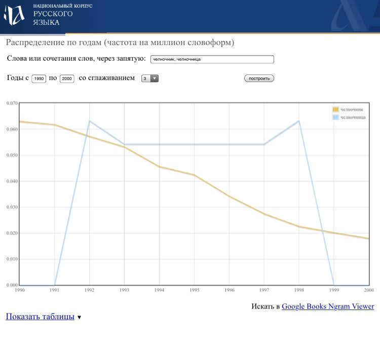
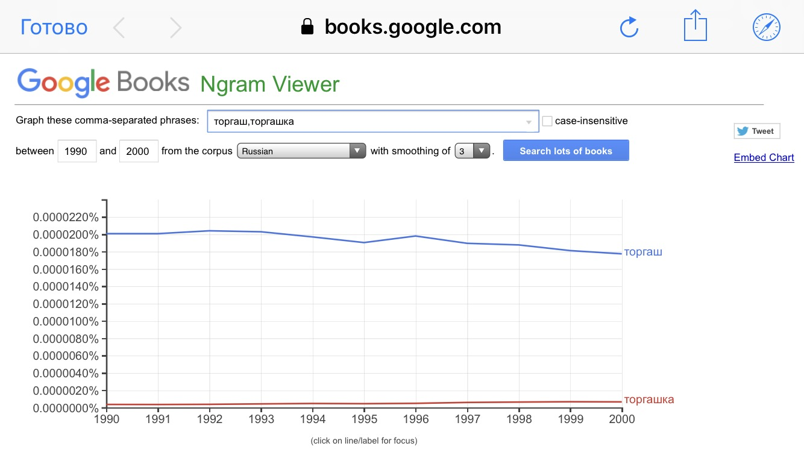
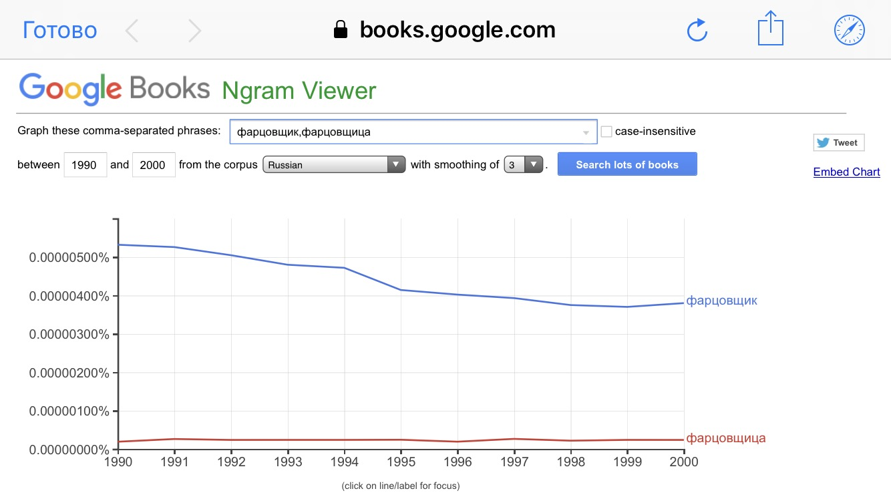

<doctype!>
<html>
<head>
<title>Проект по цифровой грамотности</title>
<meta charset="UTF-8">
<link rel="stylesheet" href="Lera.css">
</head> 
<body> 

<h1>Проект по цифровой грамотности</h1>
 
      
<h3><dfn>Употребление феминитивов в текстах 90-х – 2000-х гг.</dfn></h3>
 

 
<head>ВВЕДЕНИЕ.</head> 
  Целью нашего проекта является выявить, как часто в профессий 90-х – 2000-х гг. были феминитивы. Для этого мы возьмем самые распространенные женские профессии в это время: челночница, торгашка, фарцовщица, лоточница. Сравним частотность употребления этих слов с феминитивом и без (т. е. с мужскими профессиями). Далее подберем корпус текстов, в которых встречаются эти слова, и найдем устойчивые сочетания, связанные с этими словами, с помощью программы для обработки корпусов.  

ХОД РАБОТЫ.Мы воспользовались Google Ngrams и Национальным корпусом русского языка для определения частотности употребления профессий с феминитивами и без. Заданные временные рамки - 1990 и 2000 гг.. 
Челночник - челночница 

 

 

  
   

<h3><strong>Торгаш - торгашка </h3>
 

 
  
  

<h3><strong>Фарцовщик - фарцовщица </strong></h3>

 
 
<li>Лоточник - лоточница </li>
 

 2. Далее с помощью НКРЯ был подобран корпус текстов, в которых употреблялись названия профессий с феминитивами. Корпус представляет из себя статьи 90-х - 2000-х гг., в которых описывается жизнь этого времени. Кроме того, в корпусе есть и романы того времени, так называемое “бульварное чтиво”. 
3. С помощью AntConc был обработан  ранее составленный корпус текстов. Программа позволила составить список устойчивых сочетаний. 
Челночница 
Рядом со словом “челночница” обычно стоит слово, относящееся к поездкам за границу. Часто встречалось слово “Чувашия”, “аэропорт”, “граница”. Это и неудивительно, ведь профессия челночника была связана с постоянными выездами за рубеж.

 Торгашка. Поиск устойчивых сочетаний показал, что в большинстве случаев слово “торгашка” употребляется как ругательство, а не как обозначение профессии.

 Фарцовщик - фарцовщица. 
К сожалению, не удалось составить корпус текстов со словом “фарцовщица”. Видимо об этой профессии писали как об исключительно мужской. С другой стороны, график в Google Ngrams показал, что все же слово “фарцовщица” в те года употреблялось, хотя и немного. Такое несоответствие побудило нас все же составить корпус, но только для слова “фарцовщик”, и привести список устойчивых сочетаний с ним.

Лоточница.Употребление названия этой профессии в большинстве случаев связано с продажей еды. Также обычно в литературе лоточниц описывают как не очень привлекательных женщин с тяжелой походкой.

</strong> : Выводы </h3>

<li>  ВЫВОД 
Таким образом, благодаря анализу корпуса текста стало понятно, как воспринимали женщин, занимающихся одними из самых распространенных профессий 90-х годов. Кроме того, мы выявили частотность употребления этих слов. Неудивительно, что слова без феминитивов употреблялись чаще (так уж исторически сложилось), однако же слово “челночница”  использовалось чаще, что стало для нас “открытием”.</li>
</body> 
</html>
